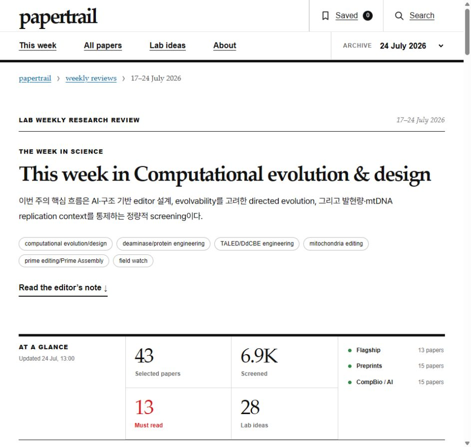

# Papertrail

<p align="center">
  
</p>

Papertrail is a public, reader-friendly website for curated literature collections generated by [Trend Tracker](https://github.com/Park-Junjae/Trend_tracker).

**[Open Papertrail](https://park-junjae.github.io/papertrail/)**

The current deployment is configured around the papers, methods, and research questions followed by a mitochondrial genome-editing laboratory. This is one working example: the same engine and web format can be used for a different research area by changing the collection and ranking configuration.

## How Papertrail and Trend Tracker fit together

1. **Trend Tracker collects** papers from configured journals, searches, and author watchlists.
2. **Trend Tracker filters and ranks** candidates using configurable topic gates and relevance rules.
3. **Trend Tracker summarizes** selected papers into structured review fields.
4. **Papertrail publishes** the approved snapshots as a searchable static website.

Trend Tracker is the analysis engine. Papertrail is the public reading and discovery layer.

## What readers can do

- browse the current weekly research brief;
- inspect all selected papers across tracker streams;
- filter by priority, topic, journal, and source;
- read concise summaries, significance notes, caveats, and follow-up ideas;
- move between archived weekly snapshots;
- save papers locally in the browser.

## Repository contents

```text
index.html       Static application shell
app.js           Search, filtering, archive, and reader interactions
styles.css       Public site styles
data/            Versioned weekly JSON snapshots
fonts/           Locally served web fonts
```

This repository is the generated public site, not the collection engine. It does not contain tracker source code, `.env` files, API keys, SSH keys, or raw credentials.

## Public-content boundary

The published snapshots contain literature metadata and the review fields intentionally selected for the public reader. They are research-triage aids, not authoritative factual databases, clinical guidance, or experimental validation. Readers should verify important claims against the linked primary sources.
